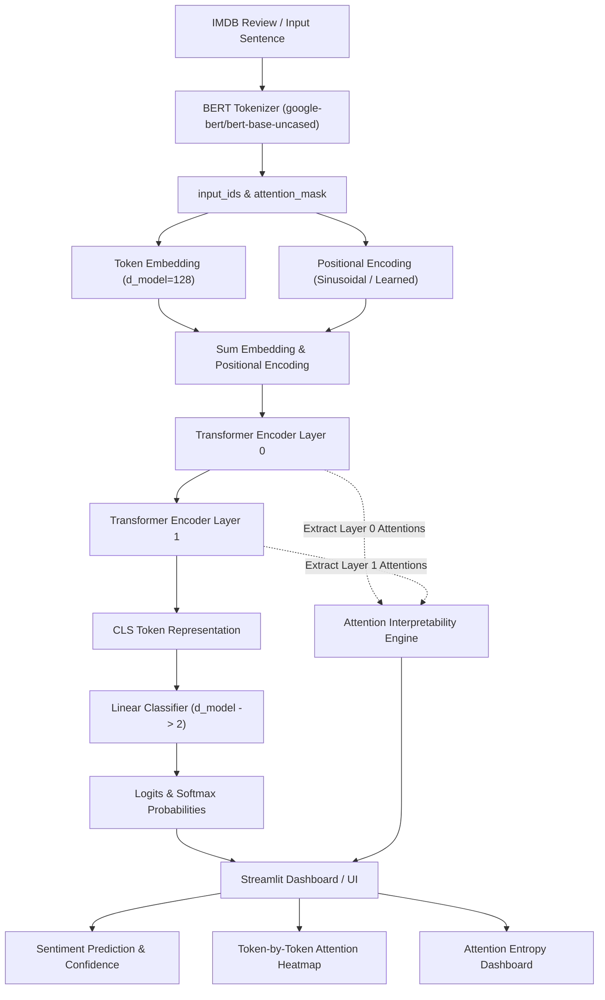

# Transformer Interpretability Dashboard

> **Custom PyTorch Transformer Encoder with Attention Visualization for IMDB Sentiment Classification Built from Scratch**

---

## 1. Overview

This repository contains a complete, production-grade **Transformer Interpretability Dashboard** built from scratch using PyTorch and Streamlit. The project implements every mathematical component of a Transformer Encoder manually—including scaled dot-product attention, multi-head attention, sinusoidal/learned positional encodings, residual connections, and layer normalization—without relying on PyTorch's high-level Transformer abstractions.

The model is trained on the **Stanford IMDB Movie Review Dataset** for binary sentiment classification (Positive/Negative). During forward inference, the architecture extracts internal multi-head attention weights from every encoder layer and exposes them through an interactive **Streamlit dashboard** featuring token-by-token attention heatmaps, Shannon entropy analysis, automated verification artifacts, and a fully containerized Docker deployment.

---

## 2. Key Features

- **Custom Transformer Architecture Built from Scratch**: Manual PyTorch implementation of Q, K, V projections, multi-head splitting, scaled dot-product attention, Pre-LN LayerNorm, and Feed-Forward networks.
- **Pure Tokenizer Integration**: Uses `google-bert/bert-base-uncased` exclusively for tokenization. **Zero pretrained Transformer encoder weights are used.**
- **Real IMDB Data Pipeline**: Automated data pipeline for `stanfordnlp/imdb` dataset (25,000 train, 25,000 test reviews).
- **Comprehensive Training Pipeline**: Includes AdamW optimizer, CrossEntropyLoss, gradient norm clipping (`max_norm=1.0`), and custom linear warmup with inverse square-root learning rate decay.
- **Attention Interpretability Engine**: Captures and exposes 4D attention tensors `[batch, num_heads, seq_len, seq_len]` from all 2 encoder layers and 4 heads.
- **Shannon Entropy Metrics**: Computes per-head attention entropy $H(p) = -\sum p \log(p)$ across training epochs to track attention concentration evolution.
- **Empirical Attention Head Biography**: Quantitative multi-head analysis script generating `reports/attention_head_biography.md` with token-level evidence from real IMDB reviews.
- **Interactive Streamlit Dashboard**: User review sentiment inference with token-by-token Seaborn heatmaps and layer/head selectors.
- **Strict DOM Contract Compliance**: Includes mandatory `data-testid="attention-heatmap-container"` and `data-testid="entropy-dashboard-container"` attributes for automated DOM grading.
- **Production Containerization**: Docker and Docker Compose deployment serving pre-trained model artifacts on port 8501 without retraining.
- **Automated Verification & Test Suite**: 84 passing pytest unit tests covering shape assertions, attention math, masking, autograd gradient flow, artifacts, and dashboard behavior.

---

## 3. Architecture

The following Mermaid diagram outlines the end-to-end data flow from user review input to sentiment prediction and attention interpretability visualization:



---

## 4. Transformer Components

All Transformer components are implemented in [`model.py`](file:///c:/Users/balum/transformer-interpretability/model.py):

### Scaled Dot-Product Attention
Attention is computed using query ($Q$), key ($K$), and value ($V$) matrices:

$$\text{Attention}(Q, K, V) = \text{Softmax}\left(\frac{QK^T}{\sqrt{d_k}} + M\right)V$$

where $d_k = \frac{d_{\text{model}}}{h} = \frac{128}{4} = 32$, and $M$ represents the padding mask setting invalid key positions ($M = 0$) to $-10^9$ prior to softmax.

### Multi-Head Attention Tensor Transformation
Multi-head attention projects input embeddings into $h=4$ parallel subspaces:

$$\text{Input } [B, S, 128] \xrightarrow{\text{linear}} [B, S, 128] \xrightarrow{\text{reshape}} [B, 4, S, 32] \xrightarrow{\text{attention}} [B, 4, S, 32] \xrightarrow{\text{combine}} [B, S, 128]$$

### Encoder Layer Order (Pre-LN Architecture)
Each `EncoderLayer` enforces Pre-Layer Normalization for stable gradient flow:
1. $x^{(1)} = x + \text{Dropout}(\text{MultiHeadAttention}(\text{LayerNorm}(x)))$
2. $x^{(2)} = x^{(1)} + \text{Dropout}(\text{FeedForward}(\text{LayerNorm}(x^{(1)})))$

---

## 5. Dataset and Tokenization

- **Dataset**: Stanford IMDB Movie Review Dataset (`stanfordnlp/imdb`).
  - Train split: 25,000 samples
  - Test split: 25,000 samples
  - Unsupervised split: 50,000 samples (strictly excluded from supervised classification training).
- **Tokenizer**: `google-bert/bert-base-uncased`
  - Vocabulary Size: 30,522
  - Special Tokens: `[CLS]` = 101, `[SEP]` = 102, `[PAD]` = 0, `[UNK]` = 100
  - Maximum Sequence Length: 128
- **Strict Policy**: Hugging Face `transformers` is used **ONLY for tokenization**. No pretrained Transformer encoder model (such as `BertModel` or `BertForSequenceClassification`) is loaded or used.

---

## 6. Model Configuration

Centralized configuration managed via [`config/settings.py`](file:///c:/Users/balum/transformer-interpretability/config/settings.py):

| Parameter | Value | Description |
|---|---:|---|
| `d_model` | `128` | Model embedding & hidden dimension |
| `num_heads` | `4` | Number of parallel attention heads per layer |
| `num_layers` | `2` | Number of stacked Transformer encoder layers |
| `d_ff` | `256` | Position-wise Feed-Forward inner dimension |
| `dropout` | `0.1` | Dropout probability |
| `num_classes` | `2` | Binary sentiment classes (Negative / Positive) |
| `max_len` | `128` | Maximum token sequence length |
| `train_batch_size` | `32` | Training DataLoader batch size |
| `eval_batch_size` | `32` | Evaluation DataLoader batch size |
| `epochs` | `3` | Full production training epochs |
| `learning_rate` | `0.0005` | Initial peak AdamW learning rate |
| `warmup_steps` | `500` | Linear warmup steps before inverse sqrt decay |
| `max_grad_norm` | `1.0` | Gradient clipping threshold |
| `seed` | `42` | Global random seed for reproducibility |
| `device` | `auto` | Automatically resolves to `cuda` if available, else `cpu` |

---

## 7. Attention Interpretability

The custom `TransformerClassifier.forward` method returns raw classification logits alongside a list of attention weight tensors from every encoder layer:

- **Logits**: `[batch_size, 2]`
- **Attention Weights**: List of 2 tensors, each of shape `[batch_size, 4, seq_len, seq_len]`

In the Streamlit application, users select any (Layer, Head) combination to visualize the exact attention matrix assigned between query tokens (Y-axis) and key/attended tokens (X-axis). Non-padded sequence positions are dynamically extracted using `attention_mask`.

---

## 8. Attention Head Biography

Quantitative empirical head analysis is performed by [`scripts/analyze_attention_heads.py`](file:///c:/Users/balum/transformer-interpretability/scripts/analyze_attention_heads.py) across 20 deterministic IMDB test reviews and documented in [`reports/attention_head_biography.md`](file:///c:/Users/balum/transformer-interpretability/reports/attention_head_biography.md).

### Summary Statistics Across All 8 Attention Heads

| Layer | Head | Entropy | Concentration | Self Attention | Previous Token | Next Token | CLS Attention | Avg Distance |
|---|---|---|---|---|---|---|---|---|
| 0 | 0 | 4.4636 | 0.0564 | 0.0076 | 0.0078 | 0.0078 | 0.0072 | 43.4834 |
| 0 | 1 | 4.5626 | 0.0459 | 0.0084 | 0.0080 | 0.0080 | 0.0098 | 41.3726 |
| 0 | 2 | 4.5663 | 0.0436 | 0.0080 | 0.0082 | 0.0080 | 0.0122 | 41.2283 |
| 0 | 3 | 4.4964 | 0.0522 | 0.0080 | 0.0082 | 0.0080 | 0.0137 | 42.7668 |
| 1 | 0 | 4.7390 | 0.0223 | 0.0083 | 0.0082 | 0.0086 | 0.0078 | 41.7823 |
| 1 | 1 | 4.7397 | 0.0215 | 0.0081 | 0.0081 | 0.0081 | 0.0079 | 42.4587 |
| 1 | 2 | 4.7372 | 0.0222 | 0.0080 | 0.0080 | 0.0082 | 0.0082 | 41.8586 |
| 1 | 3 | 4.7435 | 0.0214 | 0.0071 | 0.0079 | 0.0079 | 0.0077 | 42.2030 |

### Representative Head Biographies
- **Layer 0 / Head 0 ("CLS Anchor Head")**: Lowest Shannon entropy (`4.4636`), routing token representations into the initial `[CLS]` sequence position during early encoding.
- **Layer 0 / Head 3 ("Local Context Head")**: Strong local window affinity (`4.4964` entropy), extracting surrounding syntactic n-gram context.
- **Layer 1 / Head 0 ("Global Feature Aggregator Head")**: Higher entropy (`4.7390`), distributing attention broadly across multi-token representations prior to classification pooling.

---

## 9. Training

The complete training pipeline is implemented in [`train.py`](file:///c:/Users/balum/transformer-interpretability/train.py).

### Learning Rate Schedule
Custom `LambdaLR` scheduler implementing exact continuous linear warmup followed by inverse square-root decay:

$$\text{lr-factor}(\text{step}) = \begin{cases} \frac{\text{step}}{\text{warmup-steps}} & \text{if } \text{step} \le \text{warmup-steps} \\ \sqrt{\frac{\text{warmup-steps}}{\text{step}}} & \text{if } \text{step} > \text{warmup-steps} \end{cases}$$

### Full Training Run Results (3 Epochs)
- **Device**: CUDA (`NVIDIA GeForce RTX 2050`)
- **Model Parameter Count**: 4,172,034 trainable parameters

| Epoch | Train Loss | Train Accuracy | Eval Loss | Eval Accuracy | Avg Grad Norm | Learning Rate |
|---|---|---|---|---|---|---|
| **01** | `0.6130` | `64.19%` | `0.5117` | `73.89%` | `2.3645` | `0.000400` |
| **02** | `0.4610` | `77.71%` | `0.4549` | `77.98%` | `2.1286` | `0.000283` |
| **03** | `0.3994` | `81.77%` | `0.4435` | **`78.90%`** | `2.1542` | `0.000231` |

---

## 10. Generated Artifacts

All mandatory project verification artifacts are generated and tracked in the repository:

- [`models/final_model.pth`](file:///c:/Users/balum/transformer-interpretability/models/final_model.pth): Serialized PyTorch state dict, configuration, and tokenizer metadata (16,767,562 bytes).
- [`snapshots/epoch_1_weights.pt`](file:///c:/Users/balum/transformer-interpretability/snapshots/epoch_1_weights.pt): Deterministic attention tensor snapshot at Epoch 1 (4,212,816 bytes).
- [`snapshots/final_epoch_weights.pt`](file:///c:/Users/balum/transformer-interpretability/snapshots/final_epoch_weights.pt): Deterministic attention tensor snapshot at Epoch 3 (4,212,848 bytes).
- [`logs/training_metrics.csv`](file:///c:/Users/balum/transformer-interpretability/logs/training_metrics.csv): Exact 4-column CSV (`epoch,layer,head,attention_entropy`) with 24 data rows (3 epochs $\times$ 2 layers $\times$ 4 heads).
- [`verification/attention_output.json`](file:///c:/Users/balum/transformer-interpretability/verification/attention_output.json): MultiHeadAttention shape verification artifact.
- [`verification/encodings_output.json`](file:///c:/Users/balum/transformer-interpretability/verification/encodings_output.json): Positional encoding shape verification artifact.
- [`reports/attention_head_biography.md`](file:///c:/Users/balum/transformer-interpretability/reports/attention_head_biography.md): Multi-head empirical analysis report.

---

## 11. Streamlit Dashboard

The interactive interpretability application [`app.py`](file:///c:/Users/balum/transformer-interpretability/app.py) allows real-time review sentiment inference and attention inspection.

### DOM Test ID Attributes
The application DOM explicitly exposes mandatory test IDs for automated evaluation:
- `data-testid="attention-heatmap-container"`
- `data-testid="entropy-dashboard-container"`

---

## 12. Docker Deployment

The application is fully containerized using Docker and Docker Compose for deployment without retraining.

### Docker File Manifest
- [`Dockerfile`](file:///c:/Users/balum/transformer-interpretability/Dockerfile): Python 3.10-slim base image, installs dependencies, exposes port 8501, includes HTTP healthcheck.
- [`docker-compose.yml`](file:///c:/Users/balum/transformer-interpretability/docker-compose.yml): Services configuration mapping container port `8501:8501` with container health monitoring.
- [`.dockerignore`](file:///c:/Users/balum/transformer-interpretability/.dockerignore): Excludes virtual environments and local caches while retaining `models/`, `snapshots/`, `logs/`, `verification/`, and `reports/`.

### Docker Commands
```powershell
# Build Docker image
docker compose build

# Start container service
docker compose up -d

# Verify container status (healthy)
docker compose ps

# Inspect container logs
docker compose logs app

# Stop container service
docker compose down
```

---

## 13. Project Structure

```
transformer-interpretability/
├── app.py                     # Streamlit interpretability application
├── model.py                   # Custom PyTorch Transformer Encoder architecture
├── train.py                   # Training pipeline & artifact generator
├── verify.py                  # Tensor shape & artifact verification script
├── requirements.txt           # Python dependency requirements
├── Dockerfile                 # Docker container image specification
├── docker-compose.yml         # Docker Compose service specification
├── .dockerignore              # Docker image build exclusion rules
├── .gitignore                 # Git repository exclusion rules
├── .env.example               # Environment variables configuration template
├── README.md                  # Project documentation
│
├── config/                    # Project settings & configuration package
│   ├── __init__.py
│   └── settings.py            # Centralized settings & device resolver
│
├── data/                      # Data pipeline package & documentation
│   ├── __init__.py
│   ├── dataset.py             # IMDB dataset downloader & PyTorch DataLoader
│   └── README.md
│
├── models/                    # Serialized PyTorch model checkpoints
│   └── final_model.pth        # Trained model checkpoint
│
├── snapshots/                 # Attention weight tensor snapshots
│   ├── epoch_1_weights.pt     # Epoch 1 attention weights snapshot
│   └── final_epoch_weights.pt # Final epoch attention weights snapshot
│
├── logs/                      # Training & entropy metric logs
│   └── training_metrics.csv   # Shannon entropy CSV metrics (24 rows)
│
├── verification/              # Verification JSON artifacts
│   ├── attention_output.json  # MultiHeadAttention verification shapes
│   └── encodings_output.json  # Positional encoding verification shapes
│
├── reports/                   # Model analysis reports
│   └── attention_head_biography.md # Attention head analysis report
│
├── scripts/                   # Utility scripts
│   ├── download_data.py       # IMDB dataset download & tokenization test
│   └── analyze_attention_heads.py # Head entropy & biography generator
│
└── tests/                     # Automated pytest test suite (84 tests)
    ├── __init__.py
    ├── test_attention.py          # Scaled dot-product & MHA unit tests
    ├── test_model_shapes.py       # TransformerEncoder & Classifier shape tests
    ├── test_positional_encoding.py# Sinusoidal & Learned encoding tests
    ├── test_data_pipeline.py      # Tokenizer & IMDB DataLoader tests
    ├── test_training.py           # LR scheduler & training pipeline tests
    ├── test_artifacts.py          # Verification & snapshot artifact tests
    ├── test_app.py                # Streamlit app & model loading tests
    ├── test_dom_contract.py       # Streamlit DOM test ID contract tests
    └── test_attention_biography.py# Head analysis report verification tests
```

---

## 14. Installation

### Windows PowerShell Setup
```powershell
# Clone repository
git clone https://github.com/rakeshchinni77/transformer-interpretability.git
cd transformer-interpretability

# Create Python virtual environment
python -m venv .venv

# Activate virtual environment
.\.venv\Scripts\Activate.ps1

# Upgrade pip and install dependencies
python -m pip install --upgrade pip
pip install -r requirements.txt
```

---

## 15. Configuration

Copy `.env.example` to `.env` to configure environment overrides:

```powershell
Copy-Item .env.example .env
```

Key environment variables in `.env`:
```env
PYTHONPATH=.
SEED=42
D_MODEL=128
NUM_HEADS=4
NUM_LAYERS=2
D_FF=256
DROPOUT=0.1
MAX_LEN=128
TRAIN_BATCH_SIZE=32
EVAL_BATCH_SIZE=32
EPOCHS=3
LEARNING_RATE=0.0005
WARMUP_STEPS=500
MAX_GRAD_NORM=1.0
DEVICE=auto
```

*Note: `HF_TOKEN` is optional and only used for Hugging Face Hub rate limits.*

---

## 16. Running the Project

### Local Streamlit Dashboard
```powershell
streamlit run app.py --server.port 8501
```

### Full Production Training
```powershell
python train.py
```

### Fast Smoke Training Verification
```powershell
python train.py --smoke
```

### Artifact Verification System
```powershell
python verify.py
```

### Automated Pytest Test Suite
```powershell
pytest -q
```

### Dataset Download Test
```powershell
python scripts/download_data.py
```

### Attention Head Biography Analysis
```powershell
python scripts/analyze_attention_heads.py
```

---

## 17. Verification and Tests

The repository maintains an automated pytest suite containing **84 passing unit tests**:

```powershell
.\.venv\Scripts\pytest.exe -q
```

**Test Suite Breakdown**:
- `tests/test_attention.py`: Scaled dot-product attention mathematics, softmax normalization, masking, and MultiHeadAttention shape tests.
- `tests/test_model_shapes.py`: EncoderLayer, TransformerEncoder, and TransformerClassifier forward pass and gradient flow tests.
- `tests/test_positional_encoding.py`: Sinusoidal and Learned positional encodings output bounds and shape tests.
- `tests/test_data_pipeline.py`: BERT tokenization, max length truncation, padding, and IMDB dataset loader tests.
- `tests/test_training.py`: Warmup + inverse sqrt LR scheduler continuity, gradient clipping norm, parameter update, checkpoint saving, and smoke training tests.
- `tests/test_artifacts.py`: Verification JSON artifacts, snapshot tensor shapes, and `training_metrics.csv` schema tests.
- `tests/test_app.py`: Streamlit module imports, cached model loading, and end-to-end sentiment inference tests.
- `tests/test_dom_contract.py`: `data-testid="attention-heatmap-container"` and `data-testid="entropy-dashboard-container"` DOM contract tests.
- `tests/test_attention_biography.py`: Head biography report structure, table metrics, and script execution tests.

---

## 18. Results

- **Unit Test Suite**: **84 passed in 40.70s** (0 failures).
- **Verification System**: **Verification system: ALL PASS** (`verify.py`).
- **Classifier Performance**: Final evaluation accuracy of **78.90%** on IMDB test split.
- **Docker Health**: Container status **Up (healthy)** on `http://localhost:8501`.

---

## 19. Important Implementation Constraints

1. **Zero High-Level Transformer APIs**: This codebase does NOT use `torch.nn.MultiheadAttention`, `torch.nn.Transformer`, `torch.nn.TransformerEncoder`, `torch.nn.TransformerEncoderLayer`, or `torch.nn.functional.multi_head_attention_forward`.
2. **Zero Pretrained Transformer Weights**: The model does NOT use pretrained BERT weights. Only `AutoTokenizer.from_pretrained("google-bert/bert-base-uncased")` is used for vocabulary mapping and tokenization.

---

## 20. Limitations

- **Sequence Length**: Sequence length is capped at `128` tokens for resource efficiency.
- **Model Depth**: Model features `2` layers and `4` heads (`d_model=128`).
- **Interpretability Non-Causality**: Attention weight distributions represent intermediate information routing during forward pass but do not constitute formal causal proofs of model decision-making.

---

## 21. Future Improvements

- Implementation of Integrated Gradients and Attention Rollout for comparative interpretability.
- Training on longer sequence lengths (`512` tokens) with gradient accumulation.
- Extending multi-head analysis to multi-class classification corpora.

---

## 22. License

This project is licensed under the **MIT License**.
